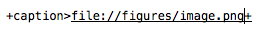



# \! Title


## \!\! Sub\-Title



-  Unordered List

&nbsp;

1.  Ordered List
    -  Second level \(nested\)


&nbsp;
<dl><dt>;head
</dt><dd>:item</dd><dt>;head
</dt><dd>:item</dd></dl>


---



-  **""bold text""**
-  *''italic text''*
-  ***""''bold italic text''""***
-  ~~<del>\-\-strikethrough text\-\-</del>~~
-  **~~<del>""\-\-bold strikethrough text\-\-""</del>~~**
-  ***~~<del>""''\-\-bold italic strikethrough text\-\-''""</del>~~***
-  \_\_underlined text\_\_
-  **""\_\_bold underlined text\_\_""**
-  *''\_\_italic underlined text\_\_''*
-  ***""''\_\_bold italic underlined text\_\_''""***
-  ***~~<del>""''\-\-\_\_bold italic strikethrough underlined text\_\_\-\-''""</del>~~***
-  Text<sub>@@subscript@@</sub>
-  Text<sup>^^supscript^^</sup>

&nbsp;


---



```
|{ Left Header 	|} Right Header | Centered Header
| Row		| Row | Row
```


for 

|  Left Header 	 |  Right Header  |  Centered Header
| :-| -:| :-:
|  Row		 |  Row  |  Row




---

@anchor<a name="anchor"></a>

[anchor](#anchor) is produced by `*anchor*`

[\*Name>http://www\.google\.fr\*](http://www.google.com)

<a name=""></a> `+caption>file://figures/image.png+`


---




    Note: @@note this is a note annotation.




---


<a name="script1"></a>**My script that works**

```smalltalk
[[[label=script1|caption=My script that works|language=Smalltalk self foo bar ]]]
```




---





{{{markdown:<br>
this is how you inject raw `markdown` in your output file
<br>\}\}\}


